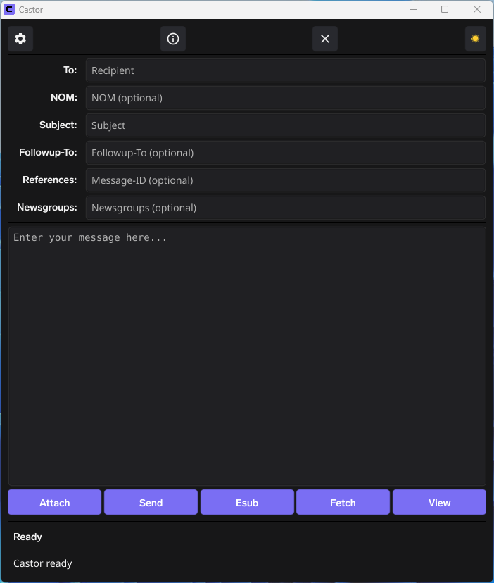

**Castor – An easy-to-use anonymous email client for [NymVPN](https://nym.com) users, with port 1080 in Settings enabled.**


As you can see in the picture, Castor has some unique features you won't find in any other email clients:



1\. A NOM (NymX Onion Mailbox) header, allowing you to promote your [NymX Onion Mailbox](https://github.com/Ch1ffr3punk/NymX-Messenger) in outgoing anonymous email messages.

2\. The Attach button, which you can use for [YAMN](https://github.com/crooks/yamn) outfiles and [AEC](https://github.com/Ch1ffr3punk/AEC)-QR Codes.

3\. The Esub button is used for an encrypted Subject: header when posting in the Usenet newsgroup alt.anonymous.messages.

4\. Fetch can be used for retrieving messages, along with your Esub password, from alt.anonymous.messages.

5\. The View button is intended for AEC-QR Codes fetched from alt.anonymous.messages.

6\. For organizations, running a postfix MTA, I have included the Hermes email gateway, which supports TLS, a whitelist or blacklist and rate-limiting.


If you have any questions about Castor, feel free to reach out to me at the following places:

Usenet Newsgroups: [alt.privacy.anon-server](https://newsgrouper.org/alt.privacy.anon-server)

Telegram Group: [YIP](https://t.me/yourinternetprivacy)

If you are a privacy enthusiast and use Castor on a regular basis consider a small donation in crypto currencies or buy me a coffee.
```
BTC: bc1qm0e7r94ht60tu7zuewf0ftl3td0xc700rvcagn
Nym: n1f0r6zzu5hgh4rprk2v2gqcyr0f5fr84zv69d3x
```
<a href="https://www.buymeacoffee.com/Ch1ffr3punk" target="_blank"></a>

Castor is dedicated to Alice and Bob.

